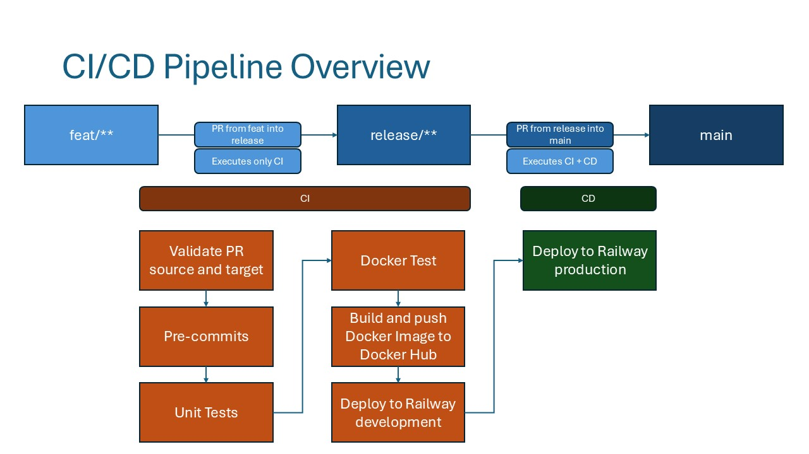

# webgame

## Table of Contents
1. [Collaborate](#collaborate)
   - [Prerequisites](#prerequisites)
   - [Project Setup](#project-setup)
2. [Build and Containerize the Web Game](#build-and-containerize-the-web-game)
   - [Steps to Build the Container](#steps-to-build-the-container)
3. [Way of Working](#way-of-working)
4. [Backlog](#backlog)
   - [Pipeline](#pipeline)
   - [Core](#core)
   - [Enhance User Engagement](#enhance-user-engagement)
   - [User Choice & Difficulty](#user-choice--difficulty)
   - [Additional Features](#additional-features)
   - [Advanced Gamification](#advanced-gamification)

## Collaborate

### Prerequisites
Before you begin collaborating on the project, ensure that you have the following installed on your machine:
- [Python 3.12.*](https://www.python.org/downloads/)
- [Docker Desktop](https://www.docker.com/products/docker-desktop/)
- (Optional) [Docker Extension for VS Code](https://marketplace.visualstudio.com/items?itemName=ms-azuretools.vscode-docker) for enhanced debugging

### Project Setup
To set up the project on your local machine:
1. **Clone the repository** from GitHub [link](https://github.com/Johnson-Mok/webgame)
```
git clone https://github.com/Johnson-Mok/webgame.git
cd webgame
```
2. **Install Poetry**: Install the specified version of Poetry for dependency management.
```
pip install poetry==1.8.3
```
3. **Install Dependencies**: Use Poetry to install all required dependencies specified in the `pyproject.toml` file.
```
poetry install
```
4. **Activate the Virtual Environment**: Enter the Poetry-managed virtual environment to begin working on the project.
```
poetry shell
```
5. **Install Pre-commit Hooks**: 
   - We use `pre-commit` hooks to ensure code quality before commits are made. Install the pre-commit hooks after setting up the project:
     ```bash
     poetry run pre-commit install
     ```
   - This will run checks automatically before each commit, ensuring compliance with code style and standards.

## Build and Containerize the Web Game
To containerize and deploy the web game, Docker is required. Ensure Docker Desktop is running before proceeding with the steps below.

### Steps to Build the Container:
1. **Ensure Docker is Running**: Verify that Docker Desktop is up and running before starting the containerization process.
2. **Make the `run.sh` Script Executable**: If you encounter issues running the `run.sh` script, check if it's executable. This step may be necessary depending on your operating system.
```bash
chmod +x run.sh
```
3. **Build the Docker Container**: Once everything is set, you can build the container by executing the `run.sh` script: 
```bash
./run.sh
```
This will execute the Docker build and deploy the game in a containerized environment.

## Way of Working

When contributing to this project, follow these Git guidelines to ensure a smooth and consistent workflow:

1. **No Commits to Main**: 
   - Direct commits to the `main` branch are prohibited. Always create a new branch for your feature, bug fix, or enhancement. Use a descriptive name for your branch (e.g., `feat/add-login`, `bugfix/fix-header`).

2. **PRs Should Satisfy CI Before Merging**:
   - All pull requests (PRs) must pass Continuous Integration (CI) checks (e.g., tests, linting) before being merged. Ensure that your code passes all tests and meets quality requirements.

3. **Commit Messages and PR Messages**:
   - Keep commit messages and pull request descriptions clear, concise, and meaningful. Each commit message should summarize the change (e.g., `fix: resolve issue with navbar layout` or `feat: add user authentication system`).
   - PR descriptions should explain what changes have been made and why, with enough detail for others to review effectively.
   - Update the Backlog in the `README.md`.

By following these guidelines, we can maintain a clean, organized, and effective workflow across the project.



## Backlog

### Pipeline
- [X] Deployment: Automate the process of deploying the application to various environments (e.g., development, staging, production). This ensures consistent and reliable deployment with minimal manual intervention.
- [X] Push application to hosting server: Set up and configure the application to be deployed to a hosting server (e.g., AWS, Azure, Heroku) and ensure it is accessible and fully functional. Automate future deployments to this server.

### Core
- [X] Score Tracking - Live Score Updates: Keep track of the player’s score as they answer questions.
- [X] Score Tracking - Improve Aesthetics of Final Score Display
- [X] Question Randomization - Random Question Order: Shuffle the order of questions each time the quiz starts.

### Enhance User Engagement
- [ ] Feedback for Each Question - Improve Aesthetics of Instant Feedback: Show whether the selected answer is correct or incorrect immediately after a user submits.
- [ ] Feedback for Each Question - Explanation: Provide a brief explanation after each question about the correct answer, helping with learning.
- [ ] Progress Tracking - Progress Bar: Show a progress bar indicating how far the user is through the quiz (e.g., “Question 5 of 10”).
- [X] Question Randomization - Randomized Options: Shuffle the multiple-choice options for each question to avoid memorization of answers.
- [ ] Visual and Audio Feedback - Visual Feedback: Use colors (e.g., green for correct, red for wrong) and animations to enhance the experience.
- [ ] Visual and Audio Feedback - Sound Effects: Add sound effects for correct or incorrect answers (optional, but can be fun).
- [ ] Score Tracking - Score History: Store and display scores from previous attempts.

### User Choice & Difficulty
- [ ] Multiple Quiz Modes - Quiz Categories: Offer different categories of quizzes (e.g., animals, history, general knowledge).
- [ ] Levels of Difficulty - Difficulty Levels: Allow users to select a difficulty level (e.g., easy, medium, hard), with different sets of questions or scoring systems.
- [ ] Timer - Countdown Timer: Add a timer for each question or for the entire quiz, encouraging quick answers.
- [ ] Timer - Display Time Left: Show how much time is left for the current question or overall quiz.
- [ ] Hints and Lifelines - Hint System: Add a hint option for each question that reveals a clue.
- [ ] Hints and Lifelines - 50/50 Lifeline: Allow users to remove two incorrect answers as a lifeline.
- [ ] Hints and Lifelines - Skip Question: Give players the option to skip a question but with a penalty on the score or time.

### Additional Features
- [ ] Leaderboard - Local Leaderboard: Store and display the highest scores achieved by players on the local machine.
- [ ] Leaderboard - Global Leaderboard: Integrate with a database or an external service to store and display global scores (optional).
- [ ] User Authentication and Profiles - User Login: Let users create accounts and log in to track their quiz performance over time.
- [ ] User Authentication and Profiles - Profile Customization: Allow users to customize their profile or avatar.
- [ ] Review Missed Questions - Review Incorrect Answers: Let users review the questions they answered incorrectly at the end of the quiz.
- [ ] Visual and Audio Feedback - Theme Customization: Allow users to customize the appearance of the quiz, such as dark/light mode or different color themes.

### Advanced Gamification
- [ ] Timer - Timed vs. Untimed Mode: Give users the option to play with or without a timer.
- [ ] Levels of Difficulty - Gradual Difficulty: Start with easy questions and increase the difficulty as the quiz progresses.
- [ ] Multiple Quiz Modes - Challenge Mode: Create a special mode where players are scored based on how quickly they answer.
- [ ] Multiple Quiz Modes - Practice Mode: Let users practice without time limits or scoring.
